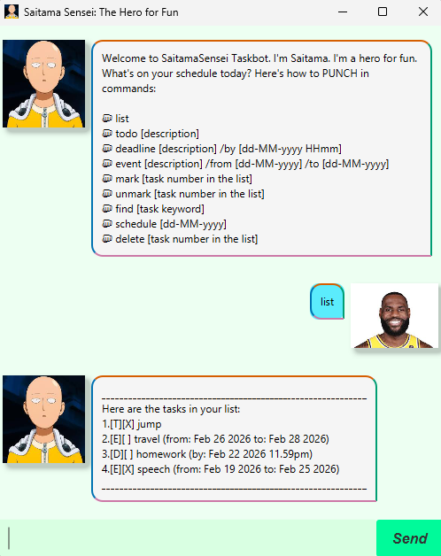

# 👊 SaitamaSensei Taskbot User Guide 👊



Saitama Sensei is a hero for fun and a task manager for efficiency. 
He helps you track your training regimen (ToDos, Deadlines, and Events) with minimal effort.

---

## Quick Start 👊
1. Ensure you have Java 17 installed.
2. Download the latest `.jar` file.
3. Run the command: `java -jar saitama.jar`.
4. Type your commands in the chat box and press Enter!

---

## Features 👊

### Showing a List: `list`
Show the current tasks that are in the list.
* Format: `list`
* Example: `list`
```
____________________________________________________________
Here are the tasks in your list:
1.[T][X] eat
2.[T][X] sleep
3.[D][] train one punch (by: May 04 2026 11.59pm)
4.[E][] fight Monster King Orochi (from:Jan 01 2026 to: Apr 25 2026)
____________________________________________________________
```

### Adding a ToDo: `todo`
Adds a simple task without a date.
* Format: `todo [description]`
* Example: `todo 100 pushups`
```
____________________________________________________________
Got it.I've added this task:
[T][] 100 pushups
Now you have 5 tasks in the list.
____________________________________________________________
```

### Adding a Deadline: `deadline`
Adds a task with a specific "by" date/time.
* Format: `deadline [description] /by [dd-MM-yyyy HHmm]`
* Example: `deadline run 10km /by 20-04-2026 1800`
```
____________________________________________________________
Got it.I've added this task:
[D][] run 10km (by: Apr 20 2026 6.00pm)
Now you have 6 tasks in the list.
____________________________________________________________
```

### Adding a Event: `event`
Adds a task with a range "from" and "to" date/time.
* Format: `event [description] /from [dd-MM-yyyy HHmm] /to [dd-MM-yyyy HHmm]`
* Example: `event to defeat Lord Boros  /from 20-02-2026 /to 20-06-2026`
```
____________________________________________________________
Got it.I've added this task:
[E][] to defeat Lord Boros (from: Feb 20 2026 to: Jun 20 2026)
Now you have 7 tasks in the list.
____________________________________________________________
```

### Mark a task: `mark`
Marks a task based on task number index in list.
* Format: `mark [task number in list]`
* Example: `mark 5`
```
____________________________________________________________
Nice! I've marked this task as done:
[T][X] 100 pushups
____________________________________________________________
```

### Unmark a task: `unmark`
Unmarks a task based on task number index in list.
* Format: `unmark [task number in list]`
* Example: `unmark 2`
```
____________________________________________________________
OK, I've marked this task as not done yet:
[T][] sleep
____________________________________________________________
```

### Finding Tasks by keyword: `find`
Finds tasks by searching for a keyword in the description.
* Format: `find [keyword]`
* Example: `find pushups`
```
____________________________________________________________
Here are the matching tasks in your list:
5.[T][X] 100 pushups
____________________________________________________________
```

### Finding Tasks by date: `schedule`
Finds tasks by searching for a keyword in the description.
* Format: `schedule [dd-MM-yyyy HHmm]`
* Example: `schedule 20-02-2026`
```
____________________________________________________________
Here are tasks in your list on the specific date (Feb 20 2026):
4.[E][] fight Monster King Orochi (from:Jan 01 2026 to: Apr 25 2026)
7.[E][] to defeat Lord Boros (from: Feb 20 2026 to: Jun 20 2026)
____________________________________________________________
```

### Deleting a Task: `delete`
Removes a task from the list using its task number index in list.
* Format: `delete [task number in list]`
* Example: `delete 1`
```
____________________________________________________________
Noted.I've removed this task:
[T][X] eat
Now you have 6 tasks in the list.
____________________________________________________________
```

### Exit from SaitamaSensei: `bye`
Exit fully from SaitamaSensei with the task saved in respective directories.
* Format: `bye`
* Example: `bye`
```
____________________________________________________________
Bye. Hope to see you again soon! 👊
____________________________________________________________
```